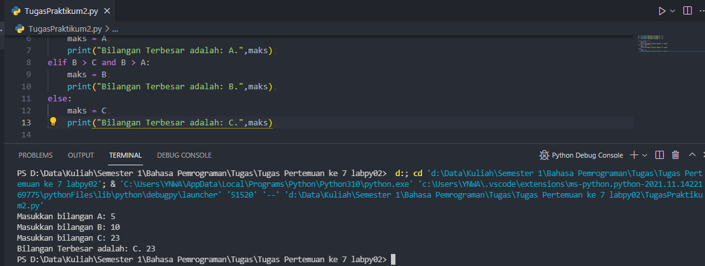
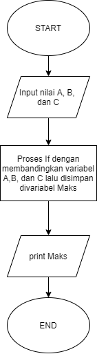

# <p align="center"> TUGAS PEMROGRAMAN - Praktikum2
[](https://www.linkedin.com/in/melvian-wijaya-760b371b1/)


<br>


# [TugasPraktikum2.py](https://github.com/melviandanuw/TugasKelilingLuasLingkaran/blob/main/tugas.py)

<p align="justify">Buat program sederhana dengan input tiga buah bilangan, dari ketiga bilangan
tersebut tampilkan bilangan terbesarnya. Gunakan statement if.

- Membuat variabel input A, B, C untuk menampung nilai bilangan.
```sh
A = int(input("Masukkan bilangan A: "))
B = int(input("Masukkan bilangan B: "))
C = int(input("Masukkan bilangan C: "))
```
- Melakukan proses if dan membandingan antara A, B, dan C.
```sh
if A > B and A > C:
    maks = A;
    print("Bilangan Terbesar adalah: A.",maks);
elif B > C and B > A:
    maks = B;
    print("Bilangan Terbesar adalah: B.",maks);
else:
    maks = C;
    print("Bilangan Terbesar adalah: C.",maks);
```
- Print Output terbesar apabila masuk ke salah satu kondisi.
```sh
print("Bilangan Terbesar adalah: A.",maks);
```

----
# Hasil Output TugasPraktikum2.py


----
# Flowchart TugasPraktikum2.py
